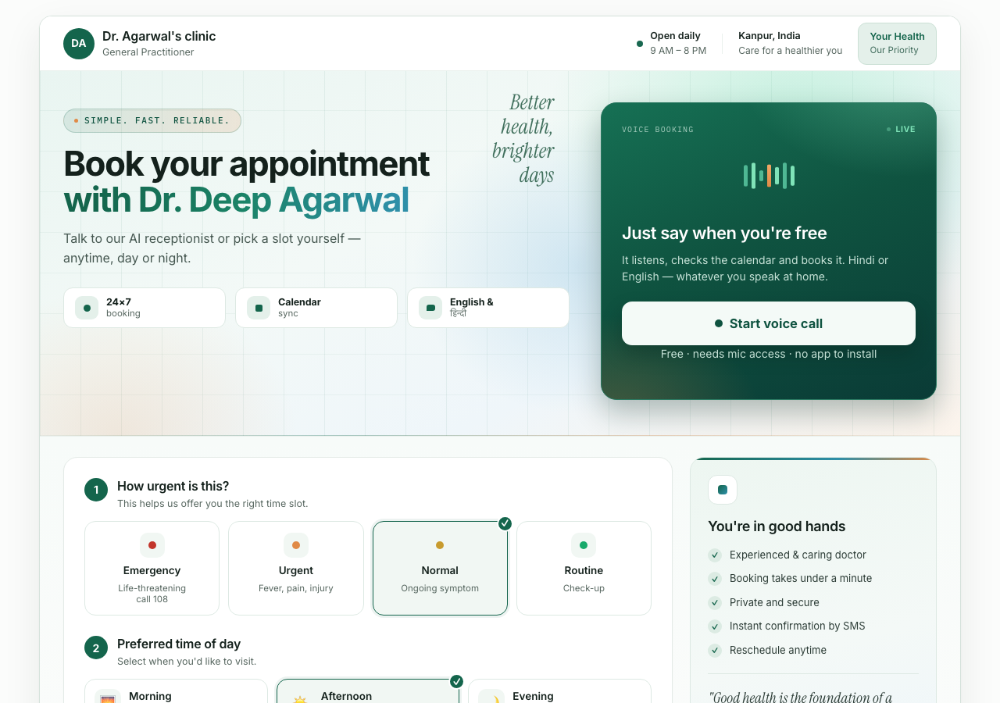
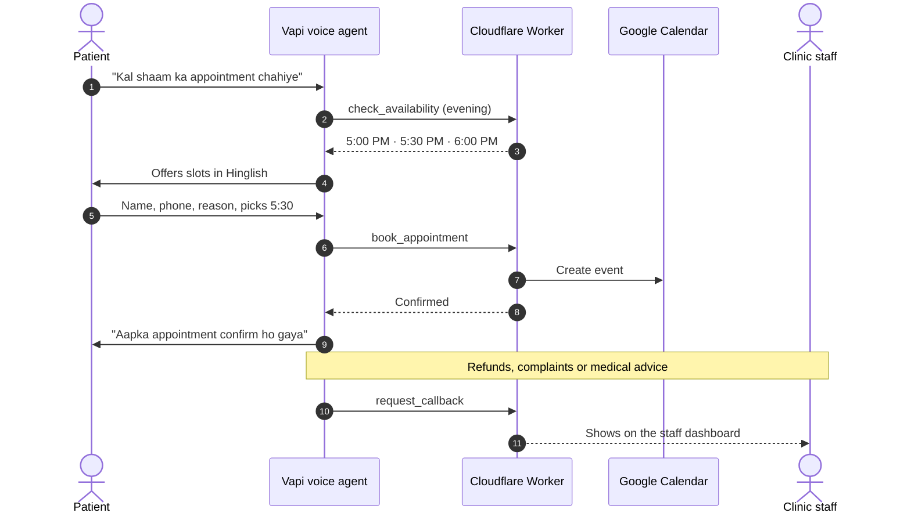
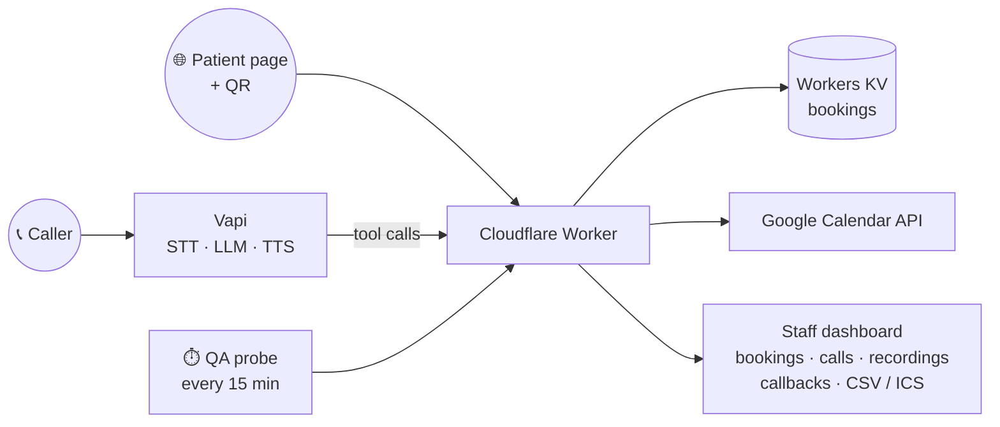

<div align="center">

# 🩺 Clinic Voice Agent

**An AI receptionist that answers the clinic phone in Hindi, English or Hinglish and books the appointment straight into Google Calendar.**




<sub>The patient booking page. Patients can talk to the AI receptionist or pick a slot themselves.</sub>

</div>

---

## The problem

Small clinics in India lose patients every time the phone rings and nobody is free to pick up. A missed call usually means a lost booking.

## The solution

A voice agent answers every call, any time of day. It speaks the caller's language, checks real availability, and books the slot. It knows when **not** to act on its own: emergencies get sent to 108, and tricky requests go to staff as a callback.

## How a call works



## Product decisions

| Decision | Why |
|---|---|
| 🚑 **Never book emergencies** | Chest pain, breathing trouble and similar cases are told to dial 108 straight away, and staff are flagged. A plain "fever" isn't escalated, so the agent doesn't over-react. |
| 🙋 **Human in the loop** | Refunds, complaints, medical advice, or a caller who stays stuck all become a staff callback, never a made-up answer. |
| 🗣️ **Language mirroring** | The agent replies in the caller's own register: English, Hinglish or Hindi. |
| 📱 **Second channel** | A self-booking web page with a printable QR code for the front desk. Cloudflare Turnstile blocks bots. |
| ✅ **Always-on QA** | A scheduled probe books a test slot every 15 minutes and checks that it really reached the calendar. |

## Evals

The agent's quality is measured, not eyeballed. [`evals/`](evals/) holds **82 test conversations across 43 categories**, for example:

> elderly callers · anxious parents · Hinglish · quiet speakers · interruptions · ambiguous vs clear emergencies · refund complaints · wrong phone lengths · fee and timing questions

Each run replays the conversations against the **same prompt and tools the live agent uses**, then scores them against a [rubric](evals/rubric.md).

```bash
OPENAI_KEY=... node evals/run.mjs            # full suite
OPENAI_KEY=... node evals/run.mjs --limit 5  # quick smoke test
```

## Architecture



| File | What it is |
|---|---|
| `agent/prompt.txt`, `agent/tools.json` | The receptionist's behaviour and tool schema, used by both Vapi and the evals |
| `worker.js` | The production backend on Cloudflare Workers |
| `vapi_sync.mjs` | Pushes the prompt and tools to the Vapi assistant |
| `evals/` | Test conversations, runner, rubric and past results |
| `server.js` | The first local Express prototype, see [README.local-dev.md](README.local-dev.md) |

## Getting started

```bash
git clone https://github.com/Deep0976/clinic-voice-agent.git
cd clinic-voice-agent
npm install

# Secrets live in Cloudflare, never in the repo
npx wrangler secret put DASHBOARD_TOKEN   # also VAPI_KEY, GCAL_SA_JSON, CALENDAR_ID, TURNSTILE_SECRET
npx wrangler deploy

VAPI_KEY=... node vapi_sync.mjs           # sync prompt and tools to Vapi
```

## Tech stack

**Voice:** Vapi · LLM tool calling
**Backend:** Cloudflare Workers · Workers KV · Cron Triggers · Turnstile
**Integrations:** Google Calendar API (service account) · ICS feed · CSV export
**Quality:** a custom eval runner with a scoring rubric

---

<div align="center">
Built by <a href="https://github.com/Deep0976">Deep Agarwal</a>
</div>
